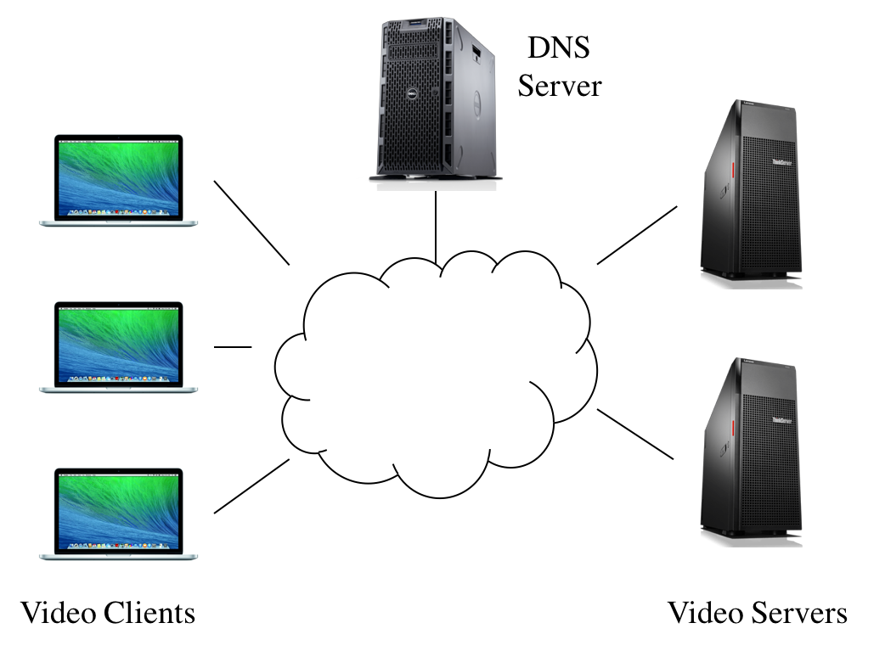
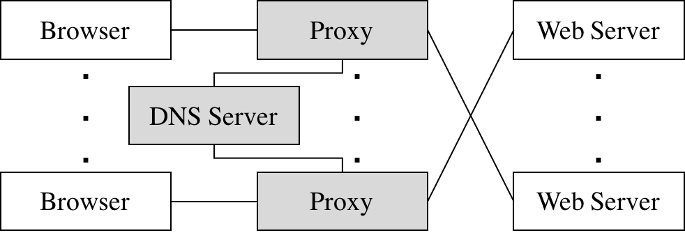
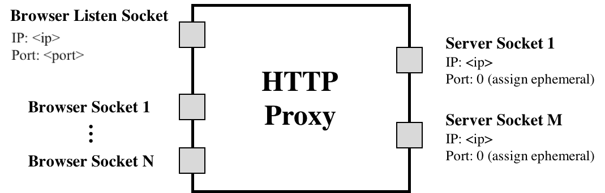

# Assignment 2: Video Streaming via CDN

<!-- markdown-toc start - Don't edit this section. Run M-x markdown-toc-refresh-toc -->
**Table of Contents**

- [Assignment 2: Video Streaming via CDN](#assignment-2-video-streaming-via-cdn)
    - [Overview](#overview)
        - [Video CDNs in the Real World](#video-cdns-in-the-real-world)
        - [Video CDN in this Assignment](#video-cdn-in-this-assignment)
    - [Before you begin](#before-you-begin)
    - [Learning Outcomes](#learning-outcomes)
    - [Clarifications](#clarifications)
    - [Part A: Bitrate Adaptation in HTTP Proxy](#part-a-bitrate-adaptation-in-http-proxy)
        - [Throughput Calculation](#throughput-calculation)
        - [Choosing a Bitrate](#choosing-a-bitrate)
        - [Running `miProxy`](#running-miproxy)
        - [miProxy Logging](#miproxy-logging)
        - [Testing miProxy](#testing-miproxy)
    - [Part B: DNS Load Balancing](#part-b-dns-load-balancing)
        - [Writing the DNS server and client](#writing-the-dns-server-and-client)
        - [Round-Robin Load Balancer](#round-robin-load-balancer)
        - [Geographic Distance Load Balancer](#geographic-distance-load-balancer)
        - [nameserver Logging](#nameserver-logging)
        - [Testing nameserver](#testing-nameserver)
        - [Testing miProxy and nameserver together](#testing-miproxy-and-nameserver-together)
    - [Submission Instructions](#submission-instructions)
    - [Grading your submission](#grading-your-submission)
    - [Acknowledgements](#acknowledgements)

<!-- markdown-toc end -->


<a name="overview"></a>
## Overview

Video traffic dominates the Internet. In this project, you will explore how video content distribution networks (CDNs) work. In particular, you will implement adaptive bitrate selection, DNS load balancing, and an HTTP proxy server to stream video at high bitrates from the closest server to a given client.

This project is divided into Part A and Part B, each with a separate deadline. Part A tests the adaptive bitrate selection proxy, and Part B tests your DNS implementation and its integration with bitrate selection.



### Video CDNs in the Real World

The figure above depicts a high level view of what this system looks like in the real world. Clients trying to stream a video first issue a DNS query to resolve the service's domain name to an IP address for one of the CDN's content servers. The CDN's authoritative DNS server selects the “best” content server for each particular client based on
(1) the client's IP address (from which it learns the client's geographic location) and
(2) current load on the content servers (which the servers periodically report to the DNS server).

Once the client has the IP address for one of the content servers, it begins requesting chunks of the video the user requested. The video is encoded at multiple bitrates. As the client player receives video data, it calculates the throughput of the transfer and it requests the highest bitrate the connection can support.

### Video CDN in this Assignment

Implementing an entire CDN is difficult. Instead, you'll focus on a simplified version. First, your entire system will run on one host and rely on Mininet to run several processes with arbitrary IP addresses on one machine. Mininet will also allow you to assign arbitrary link characteristics (bandwidth and latency) to each pair of “end hosts” (processes).



You'll write the gray-shaded components (i.e. the DNS Server and Proxy) in the figure above.

**Browser.** You'll use an off-the-shelf web browser (e.g. Chromium or Firefox) to play videos served by your CDN via your proxy. We recommend using Chromium, since that is the browser which will be used for grading. 

**Proxy.** Rather than modify the video player itself, you will implement adaptive bitrate selection in an HTTP proxy.

Here is how the bitrate adaptation is going to work:
* the player that we provide for the assignment is a standard HLS player, but we disabled its bitrate adaptation
* you will implement the bitrate adaptation in your HTTP proxy instead

Since we disabled the player's own bitrate adaptation, the player always requests the lowest bitrate indicated in the manifest.
The job of the proxy is to intercept the player's requests, and to modify them to retrieve and return the video chunks for the appropriate bitrate.

**Web Server.** Video content will be served using a simple web server that we provide (see `webserver.py` in the `grader` directory). As with the proxy, you will run multiple instances of the web server on different IP addresses to simulate a CDN with several content servers.

**DNS Server.** You will implement a simple DNS server that supports only a small portion of actual DNS's functionality. Your server will respond to each request with the “best” server for that particular client.

> *IMPORTANT: The web server, the browser, the proxy server, and the DNS server will all be launched **inside Mininet**. You should test your code inside Mininet from day 1.*

To summarize, this assignment has the following components:

* [Part A](#part1): Bitrate Adaptation in HTTP Proxy
* [Part B](#part2): DNS Load Balancing

## Before you begin

- To make it easier for us to assign scores for the assignment, please fill out the name, email and other details of every group member in [this file](../whoarewe.txt). 

- You can use the VM you downloaded for Assignment-1. However, we'd recommend installing a fresh copy of the VM if you installed additional packages. Follow these [instructions](../vm_setup.md).

> **IMPORTANT**: For Assignment-2, if you are using VirtualBox, in the VM Settings, select 'Network' and then 'Bridged Adapter' (instead of 'NAT'). You don't need to do this for UTM/Apple Silicon Macs.

## Learning Outcomes

After completing this programming assignment, students should be able to:

* Explain how HTTP proxies, DNS servers, and video CDNs work
* Create topologies and change network characteristics in Mininet to test networked systems

<a name="clarifications"></a>
## Clarifications

* For the proxy you implement in Part A, you will need to parse some HTTP traffic. To make your life easier for this project, you **do not** need to be concerned about parsing all the information in these HTTP messages. There are only two things that you need to care about searching for: `\r\n\r\n` and `Content-Length`. The former is used to denote the end of an HTTP header, and the latter is used to signify the size of the HTTP body in bytes.

* The proxy should be able to support multiple browsers playing videos simultaneously. This means you should test with multiple browsers all connecting to the same proxy. In addition you should also test with multiple proxies, each serving some number of browser(s). This is to ensure each proxy instance does not interfere with others.

* While testing the proxy you implement in Part A, you may notice that one browser may sometimes open multiple connections to your proxy server. Your proxy should still continue to function as expected in this case. In order to account for these multiple connections, you may use the browser IP address to uniquely identify each connection. This implies that while testing your proxy server, each browser will have a unique IP address.

* Throughput should be measured on each segment. For example, throughput should be calculated separately for both `video_240p_0001.ts` and `video_240p_0002.ts`.

<a name="part1"></a>
## Part A: Bitrate Adaptation in HTTP Proxy

Many video players monitor how quickly they receive data from the server and use this throughput value to request better or lower quality encodings of the video. They aim to stream the highest quality encoding that the connection can handle. Instead of modifying an existing video client to perform bitrate adaptation, you will implement this functionality in an HTTP proxy through which your browser will direct requests.

You are to implement a simple HTTP proxy, `miProxy`. It resolves the web server's DNS name, opens a connection with the resulting IP address, accepts connections from web browsers, and modifies video segment requests as described below before forwarding them to the web server. Any data returned by the server (e.g. the video segments themselves) should be forwarded, *unmodified*, to the browser. 

**All your code for this part should reside in the `miProxy` top-level directory.**

`miProxy` should listen for browser connections on the IP and port specified on the command line. It should then connect to a web server either directly specified on the command line (by its IP address), or issue a DNS query to find out the IP address of the server to contact (this is covered in Part B).



NOTE: `(assign ephemeral)` is referring to the fact that, for the client side of the connection, you don't need to bind to any specific port. The kernel will pick the proxy's TCP port when it connects to the web server. Nothing more than the proxy calling `connect()` is happening here.

Your `miProxy` should accept multiple concurrent connections from clients (web browsers) using `select()` and be able to handle the required HTTP 1.1 requests for this assignment (e.g., HTTP `GET`).

The picture above shows `miProxy` connected to multiple web servers, which would be the case if `miProxy` issued a DNS request for each new client connection received (e.g each new connection from an instance of the browser). This is one approach for utilizing the DNS `nameserver` you will write in Part B. Another approach would be to issue a DNS request **once** when `miProxy` starts up, and direct all client requests to one web server for the entire runtime of `miProxy`. Either approach is acceptable for grading purposes, but the former is preferred because it provides more efficient load balancing, and it is closer to the behavior of an actual load balancing proxy.

We will cover the basic usage of `select()` in the discussion.

> *Note: A good resource for socket programming is [Beej's Guide to Network Programming Using Internet Sockets](https://beej.us/guide/bgnet/html/).*

### Throughput Calculation

Your proxy should measure the throughput between the server and itself to determine the bitrate. It should estimate each stream's throughput for each chunk (segment). Make sure to note the start time of each chunk when your proxy started receiving the chunk from the server, and save another timestamp when you have finished receiving the chunk from the server. Given the size of the chunk, you can now compute the throughput by dividing chunk size by the time window.

Each video is a sequence of chunks (segments). To smooth your throughput estimation, you should use an exponentially-weighted moving average (EWMA). Every time you make a new measurement (as outlined above), update your current throughput estimate as follows:

`T_cur = alpha * T_new + (1 - alpha) * T_cur`

The constant `0 ≤ alpha ≤ 1` controls the tradeoff between a smooth throughput estimate (`alpha` closer to 0) and one that reacts quickly to changes (`alpha` closer to 1). You will control `alpha` via a command line argument. When a new stream starts, set `T_cur` to the *lowest* available bitrate for that video.

### Choosing a Bitrate

Once your proxy has calculated the connection's current throughput, it should select the highest offered bitrate that the connection can support. We say that a connection can support a bitrate if the average throughput is at least `n` times the bitrate (where `n` is the value specified in the `--adaptation-bitrate-multiplier` command line argument). When grading, we will set `--adaptation-bitrate-multiplier` to 1.5; this means that, before your proxy should request chunks encoded at 1000 Kbps, its current throughput estimate should be at least 1500 Kbps (1.5 Mbps).

Your proxy should learn which bitrates are available for a given video by parsing the manifest files requested at the beginning of the stream.
The format is described in the HLS RFC ([RFC 8216](https://datatracker.ietf.org/doc/html/rfc8216)).

Your proxy will replace each chunk request with a request for the same chunk at another bitrate by replacing the HTTP GET request's URI.
For example, `wing_it_240p_0037.ts` -> `wing_it_480p_0037.ts`.

### Running `miProxy`

`miProxy` should accept the following command line arguments:

```
  --proxy-host [PROXY_HOST]
                        hostname/ip where to accept connections
  --proxy-port [PROXY_PORT]
                        port number where to accept connections
  --upstream-server-host [UPSTREAM_SERVER_HOST]
                        hostname/ip address of web server hosting the video
  --upstream-server-port [UPSTREAM_SERVER_PORT]
                        port number of web server hosting the video
  --adaptation-gain [ADAPTATION_GAIN]
                        EWMA gain factor (alpha)
  --adaptation-bitrate-multiplier [ADAPTATION_BITRATE_MULTIPLIER]
                        tolerance factor for switching to a higher bitrate
  --nameserver-ip [NAMESERVER_IP]
                        ip address of DNS name server
  --nameserver-port [NAMESERVER_PORT]
                        port number of DNS name server
  --log-file-name [LOG_FILE_NAME]
                        name of reverse proxy log file
```

There are essentially two modes of operation:
* If `--proxy-host` is an IP address, `miProxy` should ignore any values specified for `--nameserver-ip` and `--nameserver-port` (if any)
* If `--proxy-host` is a domain name, `miProxy` should query the nameserver at `--nameserver-ip` and `--nameserver-port` to find out the actual IP address of the web server to contact

> **Important**: For part A, you only need to support the IP address based mode of operation. However, for part B, you will need to add support to `miproxy` to support the domain name based mode of operation. For this, you can use the `DNS` starter code we provide.

> *Note: Error handling with the arguments is not explicitly tested but is highly recommended. At the very least, printing the correct usage if something went wrong is worthwhile.*

### miProxy Logging

`miProxy` must create a log of its activity in a very particular format. If the log file, specified via a command line argument, already exists, `miProxy` overwrites the log. *After each chunk-file response from the web server*, it should append the following line to the log:

`<browser-ip> <chunkname> <server-ip> <duration> <tput> <avg-tput> <bitrate>`

* `broswer-ip` IP address of the browser issuing the request to the proxy.
* `chunkname` The name of the file your proxy requested from the web server (that is, the modified file name in the modified HTTP GET message).
* `server-ip` The IP address of the server to which the proxy forwarded this request.
* `duration` A floating point number representing the number of seconds it took to download this chunk from the web server to the proxy.
* `tput` The throughput you measured for the current chunk in Kbps.
* `avg-tput` Your current EWMA throughput estimate in Kbps.
* `bitrate` The bitrate your proxy requested for this chunk in Kbps.

### Testing miProxy

To make it easy for you to test your code, we wrote `startTopologyMininet.py`. This script will set up a simple Mininet topology, start the web server, and also start your `miProxy`. It will present you with an interactive prompt where you can set the link bandwidth to the web server.

You can start testing right away by typing http://10.0.2.100:9000 in your browser. You will see a landing page that lets you easily select between two videos that we have set up for you to test.

You can quit `startTopologyMininet.py` at any time by pressing CTRL+C.

<a name="part2"></a>
## Part B: DNS Load Balancing

To spread the load of serving videos among a group of servers, most CDNs perform some kind of load balancing. A common technique is to configure the CDN's authoritative DNS server to resolve a single domain name to one out of a set of IP addresses belonging to replicated content servers. The DNS server can use various strategies to spread the load, e.g., round-robin, shortest geographic distance, or current server load (which requires servers to periodically report their statuses to the DNS server).

In this part, you will write a simple DNS server (called `nameserver`) that implements load balancing in two different ways: round-robin and geographic distance. 

**All your code for this part should reside in the `nameserver` top-level directory.**

`nameserver` should accept the following command line arguments:
```
  --ip [IP]             ip address where DNS server should run
  --port [PORT]         port number where DNS server should run
  --domain [DOMAIN]     domain name for which to respond to queries
  --log-file-name [LOG_FILE_NAME]
                        name of reverse proxy log file
  --round-robin-ip-list-file-path [ROUND_ROBIN_IP_LIST_FILE_PATH]
                        path to a list of IP addresses for round-robin DNS load balancing
  --network-topology-file-path [NETWORK_TOPOLOGY_FILE_PATH]
                        path to a topology description file for geolocation-based DNS load balancing
```

If `--round-robin-ip-list-file-path` is specified, the nameserver should run in round-robin mode. If `--network-topology-file-path` is specified, the nameserver should run in geographic load balancing mode.

**We guarantee that exactly one of `--round-robin-ip-list-file-path` or `--network-topology-file-path` will be specified (i.e. they are mutually exclusive).**

> *Note: Error handling with the arguments is not explicitly tested but is highly recommended. At the very least, printing the correct usage if something went wrong is worthwhile.*

### Writing the DNS server and client
Implementing a fully-compliant DNS server is very complicated.
If you are interested in all the nitty-gritty details, you can read https://powerdns.org/hello-dns/basic.md.html.

For this assignment, you will only implement a small subset of that functionality.
More specifically, your implementation should be able to answer "A" record (i.e. IPv4) queries for the domain name passed in the `--domain` command line argument (we will use `video.cdn.assignment2.test` for grading). You don't need to do any recursive resolution.

To make your life easier, we provide some classes that model the DNS messages and their various parts (see `DNS` directory inside `nameserver`).
Those classes include methods for serialization/deserialization into DNS wire format.

Here is some sample code to give you an idea and get you started:
```
// Receive query
std::byte buffer[1024];
socklen_t client_addr_len = sizeof(client_addr);
int msgLen = recvfrom(sockfd, buffer, 1024, ...);
auto queryMessage = DNSMessage::deserialize(std::span(buffer, msgLen));

...

// Send response
DNSMessage responseMessage = {/* fill in response details */};
auto serializedResponse = responseMessage.serialize();
sendto(sockfd, serializedResponse.data(), serializedResponse.size(), ...);
```

### Round-Robin Load Balancer
One of the ways you will implement `nameserver` is as a simple round-robin based DNS load balancer. It should take as input a list of video server IP addresses on the command line; it responds to each request to resolve the given domain name by returning the next IP address in the list, cycling back to the beginning when the list is exhausted.

`nameserver` will bind to an IP address and port specified as command line arguments. It responds **only** to requests for the domain name specified in the `--domain` command line argument; any other requests should generate a response with `RCODE` = 3 (`NAME_ERROR`).

Example text file format in `sample_round_robin.txt`:
```
10.0.0.1
10.0.0.2
10.0.0.3
```

### Geographic Distance Load Balancer
Next you’ll make your DNS server somewhat more sophisticated. Your load balancer must return the closest video server to the client based on the proxy’s IP address. In the real world, this would be done by querying a database mapping IP prefixes to geographic locations. For your implementation, however, you will be given information in a text file about the entire state of the network, and your server will have to return to a given client its closest geographic server.

The text file will be represented in the following way:
```
NUM_NODES: <number of hosts and switches in the network>
<host_id> <CLIENT|SWITCH|SERVER> <IP address|NO_IP>
(repeats NUM_NODES - 1 times)
NUM_LINKS: <number of links in the network>
<origin_id> <destination_id> <cost>
(repeats NUM_LINKS - 1 times)
```


As an example, the network shown above will have the following text file, `sample_geography.txt`:
```
NUM_NODES: 6
0 CLIENT 10.0.0.1
1 CLIENT 10.0.0.2
2 SWITCH NO_IP
3 SWITCH NO_IP
4 SERVER 10.0.0.3
5 SERVER 10.0.0.4
NUM_LINKS: 5
0 2 1
1 2 1
2 3 1
3 4 6
3 5 1
```

### nameserver Logging
Your DNS server must log its activity in a specific format. If the log specified by the user already exists, your DNS server overwrites the log. *After each* valid DNS query it services, it should append the following line to the log:

`<client-ip> <query-name> <response-ip>`

* `client-ip` The IP address of the client who sent the query.
* `query-name` The hostname the client is trying to resolve.
* `response-ip` The IP address you return in response.

### Testing nameserver
You can use any DNS client utility (e.g. dig, nslookup, host) to test your nameserver.

For example, if the nameserver is running on `10.0.3.100` on port `53`, you can run:
```
dig @10.0.3.100 -p 53 <domain_name>
```

### Testing miProxy and nameserver together
Similar to `startTopologyMininet.py`, there is another script called `startTopologyMininetMultiHost.py` which will set up a Mininet topology that is similar but slightly more complicated. It start two instances of the web server on two different hosts, two instances of your `miProxy` on two other hosts, and an instance of `nameserver` on another host in round-robin mode (cycling between the two web servers). Same as before, you will get an interactive prompt where you can set the link bandwidths.

You can start testing right away by typing http://10.0.4.100:9000 (proxy 1) or http://10.0.5.100:9000 (proxy 2) in your browser. You will see a landing page that lets you easily select between two videos that we have set up for you to test.

You can quit `startTopologyMininetMultiHost.py` at any time by pressing CTRL+C.

<a name="submission-instr"></a>
## Submission Instructions

* All source files and the Makefile for `miProxy` and `nameserver` should be contained in (respectively) `<repo_root>/miProxy` and `<repo_root>/nameserver`.
* When running `make` in the `miProxy` directory, your Makefile should generate a binary also called `miProxy` within the `miProxy` directory.
* When running `make` in the `nameserver` directory, your Makefile should generate a binary also called `nameserver` within the `nameserver` directory.
* You should not change any code in the `grader` directory.

<a name="autograder"></a>
## Grading your submission

We also provide our grader so you can run it and make sure that your code works correctly before submitting.
Our autograder uses Chromium in headless mode to test your solutions.
For this reason, we recommend that you also do your testing with Chromium during development.

Specifically, you can run the grader by doing the following:
```
	cd grader
	sudo python3 grader.py
```

`grader.py` has several flags that you might find useful:

```
      --all          run all tests (default)
      --miproxy      run only the bitrate adaptation unit tests
      --nameserver   run only the nameserver unit tests
      --integration  run only the integration tests
      --partA        run the tests for part A grading (bitrate adaptation unit
    tests) [same as --miproxy]
      --partB        run the tests for part B grading (nameserver unit tests +
    integration tests)
```	

The grader outputs the score that you can expect for your submission.

After you submit, we will download your submitted code, and run the grader as follows to verify your score. We will evaluate your submission using the following commands (this example describes how we will evaluate part A; we will evaluate part B in a similar fashion).

```
cd miProxy
make clean; make
cd ../grader
sudo python3 grader.py --partA
```

You might want to double check that this sequence of commands works on your submission.

## Acknowledgements

This programming assignment is based on Peter Steenkiste's Project 3 from CMU CS 15-441: Computer Networks.
